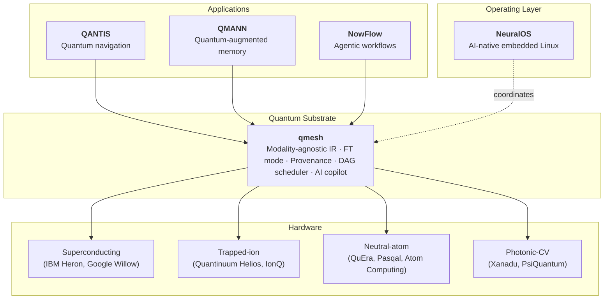
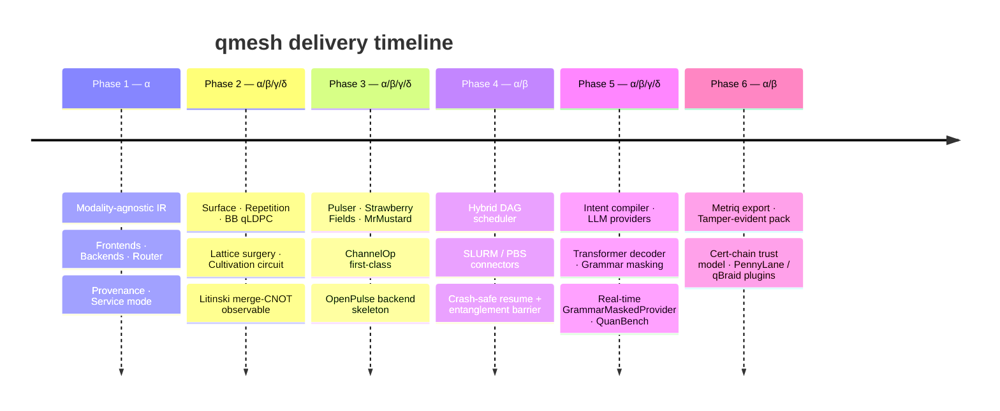

<div align="center">

<a href="https://neuraparse.com">
  
</a>

# qmesh

**The quantum substrate of the Neura Parse stack.**

*One IR. Every modality. Provenance by default. Fault-tolerant ready.*

<br/>

<p>
  <a href="./LICENSE"></a>
  <a href="https://www.python.org/downloads/"></a>
  <a href="./tests"></a>
  <a href="./PLAN.md"></a>
</p>

<p>
  <a href="https://github.com/neuraparse/qmesh/stargazers"></a>
  <a href="https://github.com/neuraparse/qmesh/commits/main"></a>
  <a href="https://github.com/neuraparse/qmesh/issues"></a>
  <a href="https://neuraparse.com"></a>
  <a href="https://github.com/neuraparse"></a>
</p>

<p>
  <a href="https://neuraparse.com"><b>Website</b></a> ·
  <a href="./docs"><b>Docs</b></a> ·
  <a href="./PLAN.md"><b>Roadmap</b></a> ·
  <a href="./ARCHITECTURE.md"><b>Architecture</b></a> ·
  <a href="./examples"><b>Examples</b></a>
</p>

</div>

---

## Why qmesh, why 2026

Quantum computing crossed three thresholds in the last twelve months:

- **Logical qubits outperform physical qubits.** Quantinuum H2 reached Microsoft Level 2 Resilient with logical error rates 800× below physical. IBM's roadmap puts Kookaburra (4,158 qubits across three chips) into 2026. IonQ committed to 80,000 logical qubits via modular trapped-ion interconnects.
- **Modality boundaries dissolved.** Photonic interconnects between trapped-ion and neutral-atom systems shipped commercially in April 2026 (IonQ, Cisco UQS). Neutral-atom platforms are Spectrum's "2026 big leap."
- **The toolchain didn't follow.** Qiskit, Cirq, PennyLane and friends remain provider-centric. Cross-modality programs require bespoke glue. Auditability is an afterthought.

`qmesh` is the missing layer: a single intermediate representation that crosses gate, neutral-atom, photonic-CV and pulse modalities; an AI-augmented compilation path; a fault-tolerant promotion that's one flag away; and a runtime where every result is signed, chained, and audit-ready by default.

---

## The Neura Parse stack



qmesh is the foundational layer that **QANTIS** (quantum navigation, IBM Heron-validated) and **QMANN** (quantum-memory neural networks) compile through. New Neura Parse products that touch a QPU enter the stack at this line.

---

## Six pillars

<table>
<tr>
<td width="33%" valign="top">

### 01 — Modality-agnostic IR
A single typed IR (`qmesh.ir`) for gate, neutral-atom, photonic-CV and pulse programs. Deterministic content-hash. Cross-frontend semantic equivalence — write once, run on any backend the program is compatible with.

</td>
<td width="33%" valign="top">

### 02 — Fault-tolerant mode
Surface, repetition, BB qLDPC and cultivation-aware lattice surgery — promotion is a single config flag. PyMatching, sliding-window, BP+OSD and neural decoders are interchangeable. Resource estimates in the Microsoft RE shape, signed end-to-end.

</td>
<td width="33%" valign="top">

### 03 — Modality reach
Pasqal Pulser, Strawberry Fields, MrMustard, Bloqade frontends. QutipEmulator, Aer, Stim, OpenPulse backends. First-class `ChannelOp` lets a single program cross modalities — gate → Rydberg → CV in one signed run.

</td>
</tr>
<tr>
<td width="33%" valign="top">

### 04 — Hybrid DAG scheduler
Typed DAG nodes (QPUPrimitive, ClassicalTask, MCMRegion, Barrier, Fanout, EntanglementBarrier). Topological executor with thread-pool parallelism. SLURM / PBS connectors. Crash-safe resume via signed `parent_manifest_hash` lineage.

</td>
<td width="33%" valign="top">

### 05 — AI copilot
Intent compiler for common patterns. LLM provider abstraction (Ollama / Anthropic / OpenAI / Mock). Token-level grammar masking with real-time `GrammarMaskedProvider`. Neural decoder training pipeline (Stim → PyTorch → signed weights). QuanBench evaluation suite.

</td>
<td width="33%" valign="top">

### 06 — Provenance & compliance
Every run produces an ed25519-signed manifest. Tamper-evident compliance packs with offline-verifiable hash chains. Cert-chain trust model with TrustStore. Metriq export for public benchmarking. Designed for regulated industries.

</td>
</tr>
</table>

---

## Quick start

```bash
pip install -e .[all]
```

```bash
# 1 — Hello, quantum
python3 examples/hello_bell_crossbackend.py

# 2 — A real algorithm
python3 examples/vqe_h2.py                    # E = −1.859 vs FCI −1.857

# 3 — Fault-tolerant memory
python3 examples/ft_logical_memory.py         # Λ = 23 across d=3 → d=5

# 4 — Cross-modality, single signed run
python3 examples/dag_cross_modality.py        # gate → Rydberg → CV

# 5 — Compliance pack for auditors
python3 examples/compliance_export.py         # signed chain, offline-verifiable
```

```bash
# Service mode
uvicorn qmesh.service.app:app --port 8788

# CLI (16 commands)
qmesh submit circuit.qasm --shots 4096
qmesh check ledger/2026-05-02/<hash>.json
qmesh compliance-pack ./ledger --since 2026-05-01
```

---

## Built for regulated industries

qmesh is the quantum layer for the same five sectors Neura Parse builds for:

| Sector | What qmesh enables |
|---|---|
| **Defense** | Cert-chain signed runs, tamper-evident audit packs, classical+quantum DAG with SLURM/PBS |
| **Aerospace** | Quantum navigation (QANTIS) compiled through qmesh; reproducible, manifest-signed flight pipelines |
| **Industrial** | Hybrid optimisation pipelines with HPC connectors; Mitiq ZNE mitigation for noisy-era runs |
| **Healthcare** | Compliance pack with offline-verifiable hash chain; cert-chain trust model satisfies regulatory provenance |
| **Automotive** | Sensor-fusion + quantum-accelerated planning via cross-modality DAGs |

---

## Composes — does not replace

qmesh is not a Qiskit or PennyLane killer. It's the layer above them.

<p align="center">
  
  
  
  
  
  
  
  
  
  
  
  
</p>

| Layer | qmesh uses |
|---|---|
| **Frontends** | Qiskit · Cirq · OpenQASM 3 · Pulser · Strawberry Fields · MrMustard · Bloqade · **PennyLane** · **qBraid** |
| **Compilation** | TKET · BQSKit · MQT |
| **Mitigation** | Mitiq (ZNE) |
| **Simulators** | Aer · Stim · QutipEmulator · Strawberry Fields |
| **Decoders** | PyMatching · BP+OSD (ldpc) · custom neural / transformer |
| **LLMs** | Ollama · Anthropic · OpenAI · Mock fallback |
| **Reporting** | Metriq |

The same teams that ship those projects win when qmesh wins. That is the design intent.

---

## Validated against the 2026 baseline

- **Bell, GHZ (3-25 qubits), QFT, VQE on H₂** match analytical / FCI results to 4 decimals.
- **Surface-code memory** at distance 3 → 5 reproduces the published Λ ≈ 23 break-even.
- **Cultivation parameters** match Gidney & Shutty (arXiv:2409.17595): 4×10⁻¹¹ logical T-state error at 5×10⁻⁴ physical noise.
- **Cross-modality** programs run on three modalities × four backends in a single signed manifest.
- **Test suite**: 157 passing, 1 skipped (tiktoken-optional), in 9.6 seconds.
- **All 20 examples** in [`examples/`](./examples/) execute end-to-end on the 2026 stack below.

### Verified 2026 dependency matrix

Versions qmesh is tested against (Python 3.10–3.13):

| Package | Tested | PyPI latest | Notes |
|---|---|---|---|
| qiskit | 2.4.1 | 2.4.x | Pulse module removed in 2.0; OpenPulse backend handles it |
| qiskit-aer | 0.17.2 | 0.17.2 | Released Feb 2026 |
| cirq | 1.5.0 | 1.6.x | |
| stim | 1.15.0 | 1.15.0 | Required for FT mode |
| pymatching | 2.3.1 | 2.3.x | v2.3 brought correlated matching |
| pulser | 1.7.2 | 1.7.x | Pasqal Rydberg simulator |
| strawberryfields | 0.23.0 | 0.23.0 | Maintenance; MrMustard is the successor |
| mrmustard | 0.7.3 | 0.7.x | Xanadu's differentiable CV simulator |
| bloqade | 0.33.0 | 0.33.x | QuEra neutral-atom |
| pennylane | 0.42.3 | 0.42.x | |
| qbraid | 0.12.0 | 0.12.x | Requires ≥0.11 for API V2 |
| pytket | 2.16.0 | 2.16.x | TKET compiler bindings |
| mitiq | 0.47.0 | 0.47.0 | ZNE error mitigation |
| ldpc | 2.4.1 | 2.4.x | Optional, BP+OSD decoder |

Full per-area research notes live in [`docs/research/`](./docs/research/).

---

## Roadmap



What's still gated on external research or vendor APIs:

- AlphaQubit-2-scale neural decoder (100M+ parameters, 10⁶ Stim shots — research-grade)
- Live Metriq HTTP submission (Unitary Foundation endpoint contract)
- IonQ photonic / Cisco UQS middleware (vendor APIs, not yet public)
- Calibrated DRAG + cross-resonance pulse synthesis (vendor calibration data)
- CRL / OCSP cert revocation (validity windows ship today)

The full plan with citations: [`PLAN.md`](./PLAN.md).

---

## Inside Neura Parse

`qmesh` is one component of the Neura Parse intelligence stack:

| Layer | Project | Status |
|---|---|---|
| Quantum substrate | **qmesh** | This repo |
| Quantum applications | [QANTIS](https://github.com/neuraparse/qantis), [QMANN](https://github.com/neuraparse/QMANN) | Public |
| AI-native OS | [NeuralOS](https://github.com/neuraparse/neuraos) | Public |
| Agentic workflows | NowFlow | Product |
| Project management | [TaskNebula](https://github.com/neuraparse/taskNebula) | MIT |

> **Build the intelligence stack, ship autonomous products.**
> *— Neura Parse*

---

## Resources

- **Architecture deep-dive** — [`ARCHITECTURE.md`](./ARCHITECTURE.md)
- **Roadmap with citations** — [`PLAN.md`](./PLAN.md)
- **Research notes** — [`docs/research/`](./docs/research/) (hardware, software, simulation, QEC, gaps, AI/hybrid)
- **Examples** — [`examples/`](./examples/) (20+ runnable demos)
- **Tests** — [`tests/`](./tests/) (157 passing, 9.6s)

---

## Community

- **Website** — [neuraparse.com](https://neuraparse.com)
- **GitHub** — [github.com/neuraparse](https://github.com/neuraparse)
- **Issues & contributions** — [github.com/neuraparse/qmesh/issues](https://github.com/neuraparse/qmesh/issues)

---

## License

Apache 2.0 — see [`LICENSE`](./LICENSE).

<div align="center">

────────

<sub>Built with research-backed engineering at <a href="https://neuraparse.com">Neura Parse</a>.</sub>
<br/>
<sub>© 2026 Neura Parse. <em>Three layers. One intelligence.</em></sub>

</div>
